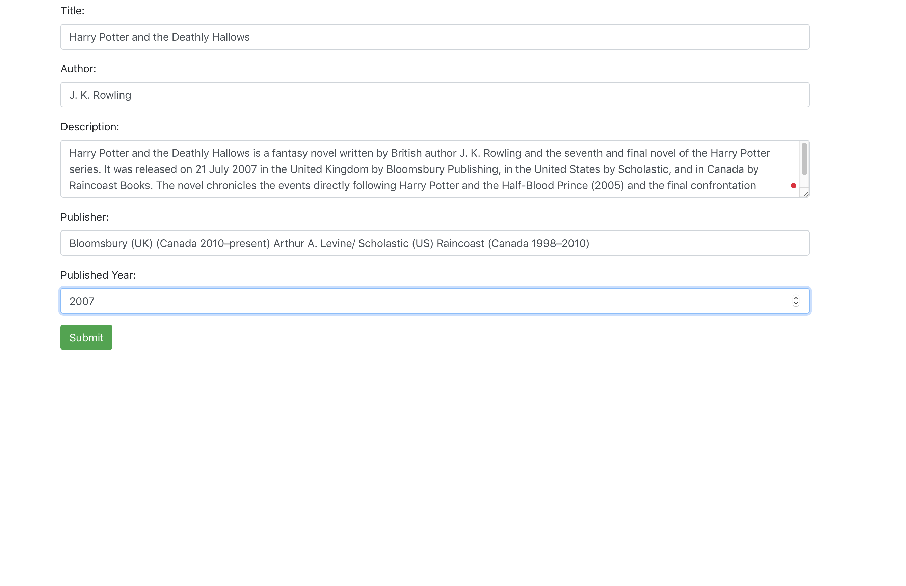
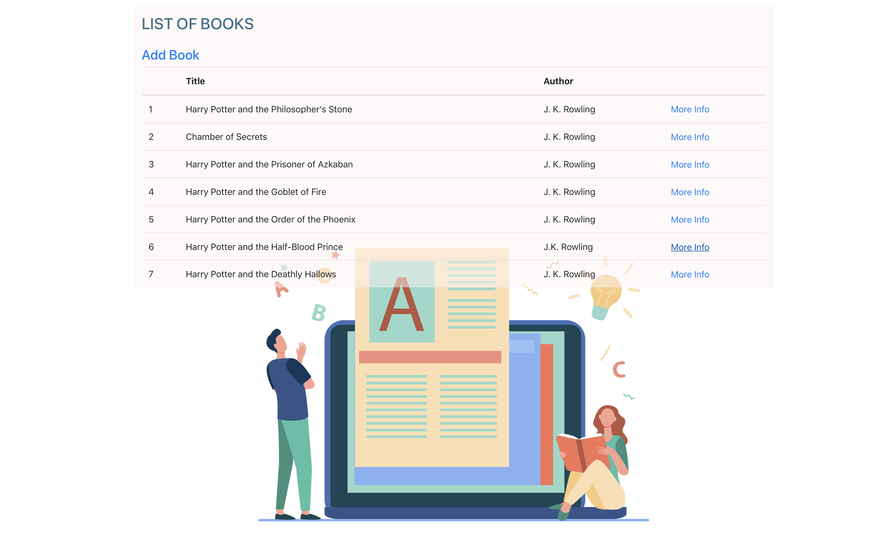
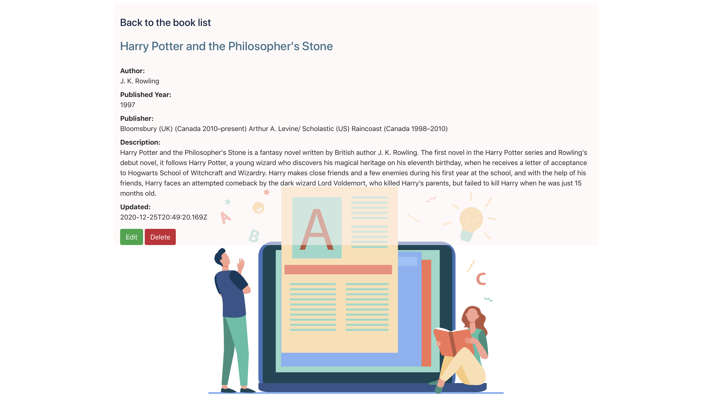

# mern-graphql-crud-books-app
Books CRUD app using MERN stack and graphgl

<h2>Image and icon Sources </h2>

<a href="https://unsplash.com" >unsplash</a>
 
<a href="https://icons8.com" >icons8</a>

<h2>Color Pallet </h2>

I've used <a href="https://colorhunt.co/palette/153879" >colorhunt</a> , <a href="https://www.color-hex.com" >color-hex</a> and this color pallet 

 

<h2>Dependencies and dev-dependencies</h2>

<ol>
<li>react-scripts</li>
  <li>react-scripts</li>
  <li>react-router-dom</li>
  <li>react-dom</li>
  <li>react</li>
  <li>react-apollo</li>
  <li>graphql-tag</li>
  <li>graphql</li>
  <li>bootstrap</li>
  <li>apollo-boost</li>
  <li>express</li>
    <li>express-graphql</li>  
  <li>graphql</li>  
  <li>graphql-date</li> 
  <li>http-errors</li> 
  <li>jade</li>
  <li>mongoose</li>
    <li>morgan</li> 
  <li>debug</li> 
  <li>cors</li>
  <li>bluebird</li> 
  <li>cookie-parser</li>
</ol>
